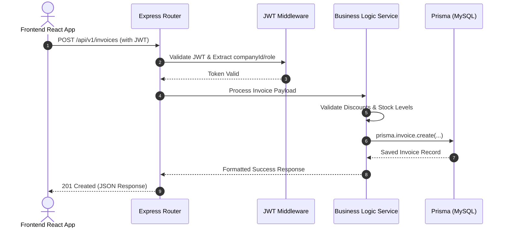

# System Architecture Document

This document defines the system architecture, directory structure, data flow patterns, and deployment strategies for the **Os Books SaaS** application.

> [!IMPORTANT]
> **Zero Mock Data Policy**: All data flows are fully integrated with the MySQL database via Prisma ORM. No fake responses, client-side session fallbacks, or in-memory array mocks are allowed.

---

## 1. Full Backend Architecture Design

The backend is structured as a RESTful API service built on **Node.js and Express**, communicating with a **MySQL** database via **Prisma ORM**.

*   **API Layer**: Express.js routers handle incoming HTTP requests from the React frontend, validate payloads, and enforce JWT authentication.
*   **Service Layer**: Encapsulates core business logic (e.g., subscription upgrades, discount calculations).
*   **Data Access Layer**: Prisma Client executes strictly typed database queries.
*   **Stateless Design**: The server is entirely stateless. Sessions are managed via JWTs. No Redis dependency exists.

---

## 2. Environment Configuration Strategy

The system enforces a strict **zero-branching** environment strategy. This ensures that local development and Railway deployment behave identically.

*   **Single Source of Truth**: All configurations are derived from environment variables.
    *   `DATABASE_URL`: Connection string for MySQL.
    *   `PORT`: Server listening port.
    *   `JWT_SECRET`: Secret for signing auth tokens.
*   **No Environment Checks**: The codebase does NOT contain environment-specific switching logic (e.g., `if (process.env.NODE_ENV === 'production')`) for core database or routing connections.
*   **No Platform-Specific Fallbacks**: The server does not attempt to fall back to SQLite or any other local database. It strictly requires the `DATABASE_URL`.

---

## 3. Prisma + MySQL Lifecycle & Connection Management

Prisma handles database modeling, migrations, and query generation. The connection lifecycle management includes:

*   **Initialization**: Prisma Client is instantiated once at the module level (e.g., `const prisma = new PrismaClient()`). It lazily connects to the MySQL database on the first query execution.
*   **Connection Pooling**: Prisma automatically manages connection pooling. Under the hood, the engine maintains a pool of connections to MySQL. The pool size can be adjusted using connection string parameters in `DATABASE_URL` (e.g., `&connection_limit=10`).
*   **Zero Local-Only Code**: The database adapter, engine, and client generators are identical for local development and Railway deployment. No platform-specific overrides are allowed.

---

## 4. Server Lifecycle (Startup & Shutdown Flow)

The Node.js Express server manages startup initialization and graceful shutdown hooks to prevent request dropping and connection leaks.

### 4.1 Server Startup Flow
1.  **Environment Loading**: Load configuration variables (`PORT`, `DATABASE_URL`, `JWT_SECRET`) from `process.env`.
2.  **App Initialization**: Instantiate Express, register standard middleware (CORS, parser, logger).
3.  **Router Registration**: Register all API modules (`auth`, `companies`, `plans`, `products`, `customers`, `invoices`, `audit-logs`, `dashboard`).
4.  **Database Connection Warm-up**: Perform an initial database health check query (e.g., querying for a single record or raw status) to warm up the Prisma connection pool.
5.  **Listen**: Bind to the assigned `process.env.PORT` (or default port `5000` / `3000`).

### 4.2 Graceful Shutdown Flow
Upon receiving termination signals (`SIGTERM` or `SIGINT`):
1.  **Stop Accepting Requests**: Stop the Express server from accepting new HTTP requests.
2.  **Drain Connections**: Wait for active request cycles to complete.
3.  **Disconnect ORM**: Invoke `await prisma.$disconnect()` to gracefully close all active MySQL pool connections.
4.  **Process Exit**: Terminate the Node.js process with status code `0`.

---

## 5. Request Flow (Frontend → Backend → DB → Response)

The data flow for a typical request (e.g., creating a sales invoice) follows this sequence:

---

## 6. Technology Stack (Frontend & Backend)

### Backend Stack
*   **Runtime**: Node.js
*   **Framework**: Express.js
*   **Database**: MySQL
*   **ORM**: Prisma
*   **Security**: JSON Web Tokens (JWT), bcrypt for passwords.

### Frontend Stack (Pre-existing)
*   **Framework**: React 19 + Vite 8
*   **Styling**: TailwindCSS 4
*   **Routing**: React Router DOM 7
*   **State Management**: Context API
*   **Visualizations**: Recharts 3

