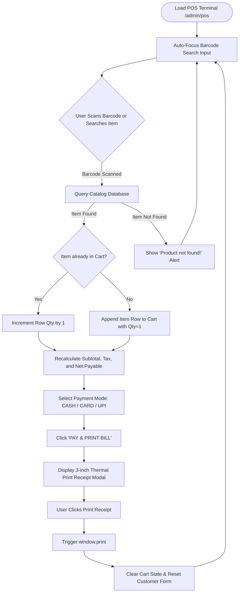
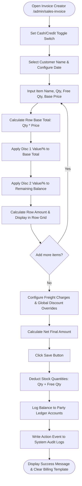
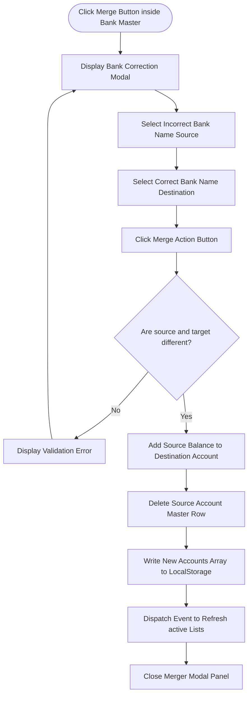
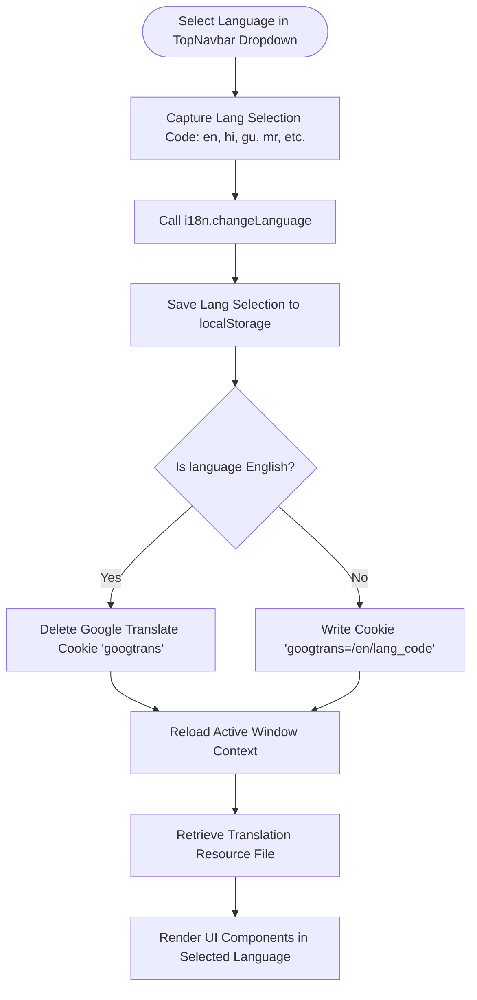

# Application Workflows & Diagrams

This document outlines the operational workflows, user actions, data loops, and execution diagrams for the core features of the **Os Books (The Digital Accounting Book)** system.

---

## 1. POS Retail Checkout Flow

### 1.1 Process Steps
1.  **Scanner Focus Lock**: Upon loading `/admin/pos`, the cursor auto-focuses onto the barcode input.
2.  **Code Identification**: The operator scans an item barcode or types search queries.
3.  **Cart Updates**:
    *   If the barcode matches a catalog item, the system appends the item or increments its quantity.
    *   Subtotal, tax weights, and net totals recalculate.
4.  **Checkout & Payment**: The operator selects a payment method (Cash, Card, UPI) and clicks "PAY & PRINT BILL".
5.  **Receipt Generation**: The thermal print overlay triggers, and the session cart resets for the next scan.

### 1.2 Checkout Sequence Flowchart

---

## 2. Sales Invoice Creation Flow

### 2.1 Process Steps
1.  **Header Setup**: The billing user sets the billing mode (Cash or Credit) and selects/inputs customer details.
2.  **Item Entry**:
    *   Rows are added inside the item grid with product selectors, base prices, quantity rates, and free quantity allotments.
    *   **Double Brackets Discounts**: Discount 1 acts first on the row base sum; Discount 2 is calculated on the remaining balance.
3.  **Summary Adjustments**: The user configures manual invoice-level discount percentages and freight charges.
4.  **Registry Completion**: Clicking "Save" logs the transaction, updates ledger balances, and deducts physical inventory items from the active warehouse catalog.

### 2.2 Invoicing State Flowchart

---

## 3. Account Ledger Merger Flow

### 3.1 Process Steps
1.  **Initiation**: The user clicks the "Merge" action inside the Bank Details panel.
2.  **Validation Check**: The user selects the incorrect account profile and the correct target profile.
3.  **Balance Summation**: The balance of the incorrect account is added to the target profile.
4.  **Database Write**: The incorrect account is deleted, and the updated database is written to local storage.

### 3.2 Merger Execution Flowchart

---

## 4. Multi-Language Switcher Flow

### 4.1 Process Steps
1.  The user selects a locale (e.g., Hindi, Gujarati, Marathi) from the top navigation language dropdown.
2.  The i18n instance shifts active locale namespaces.
3.  Translation cookies are written to ensure persistent translations on reload.
4.  The system triggers a page hard-refresh to apply the translations.

### 4.2 Translation Flowchart

