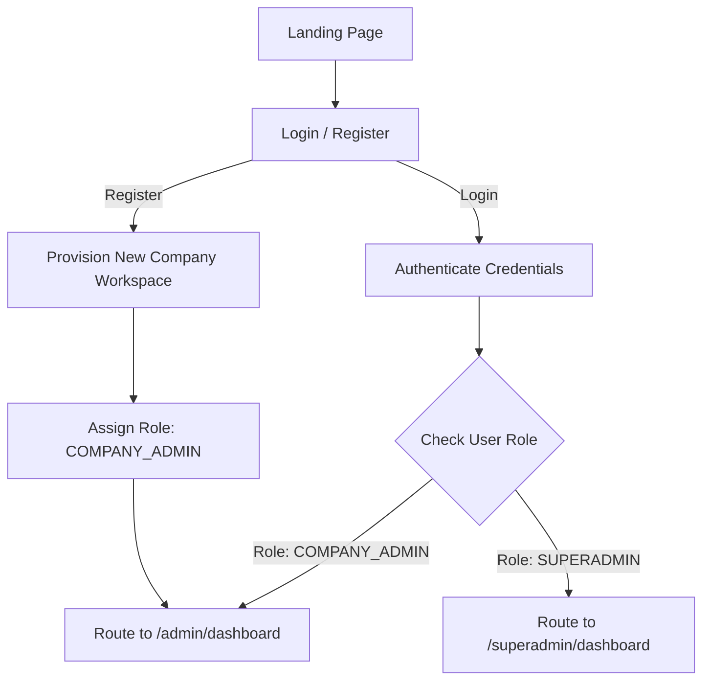
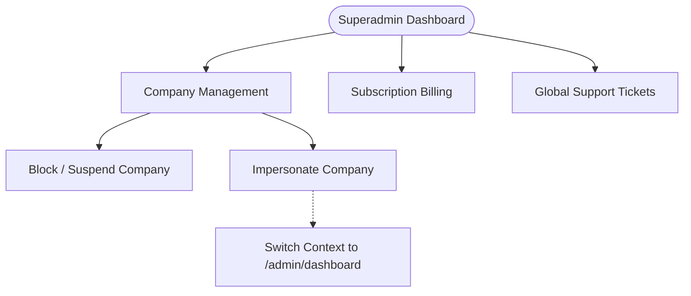
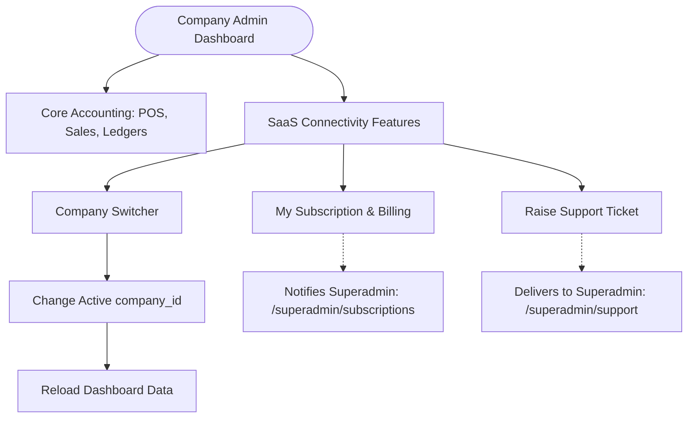

# Complete System Flow: Landing Page, Superadmin & Company Admin

This document outlines the complete end-to-end flow of the application, starting from the Landing Page and branching into the Superadmin Dashboard and Company Admin (Tenant) Dashboard.

---

## 1. Landing Page & Authentication Flow

The Landing Page serves as the public-facing entry point for all users (both Superadmins and Company Admins/Tenants).

### 1.1 Process Steps
1. **Visitor Arrival**: User lands on the public home page (Landing Page).
2. **Call to Action**: User clicks on "Login" or "Get Started / Register".
3. **Authentication**:
   - **New User (Registration)**: User signs up for a new account, selects a SaaS subscription plan, and a new Company (Tenant) workspace is provisioned.
   - **Existing User (Login)**: User enters their credentials.
4. **Role Evaluation & Routing**:
   - The backend returns a JWT containing the user's `role` and `company_id`.
   - The application evaluates the `role`:
     - If `role === 'SUPERADMIN'`, the user is routed to `/superadmin/dashboard`.
     - If `role === 'COMPANY_ADMIN'` (or standard user), the user is routed to `/admin/dashboard`.

### 1.2 Authentication Flowchart

---

## 2. Superadmin Dashboard Flow

The Superadmin Dashboard is restricted to the platform owners. It controls the global SaaS metrics, tenant management, and subscriptions.

### 2.1 Process Steps
1. **Global Overview**: Superadmin logs in and views high-level KPIs (Total Companies, MRR, Pending Tickets).
2. **Tenant Management**: 
   - Superadmin navigates to `/superadmin/companies`.
   - Can Block/Suspend accounts for non-payment.
   - Can use **Impersonate (Login-as)** to temporarily gain access to a specific Company Admin's dashboard for support purposes.
3. **Subscription Management**: Superadmin tracks active plans and payments in `/superadmin/subscriptions`.
4. **Support & Broadcast**: Superadmin replies to tenant support tickets and broadcasts global announcements (e.g., maintenance alerts).

### 2.2 Superadmin Operations Flowchart

---

## 3. Company Admin (Tenant) Dashboard Flow

The Company Admin Dashboard is the core accounting software interface where businesses manage their day-to-day operations.

### 3.1 Process Steps
1. **Tenant Overview**: Company Admin logs in and views their specific business metrics (Sales, POS, Ledgers).
2. **Business Operations**: Admin uses POS, creates Invoices, and manages accounting.
3. **Multi-Company Switching**: If a single user owns multiple companies, they can use the **Company Switcher** in the top navbar to toggle between different business workspaces without logging out.
4. **Superadmin Interaction**:
   - Admin views global announcements broadcasted by the Superadmin.
   - Admin navigates to `/admin/billing` to renew or upgrade their SaaS subscription.
   - Admin navigates to `/admin/support` to raise tickets directly to the Superadmin.

### 3.2 Company Admin & Superadmin Connectivity Flowchart

---

## 4. End-to-End System Integration Summary

1. **Entry**: Everything begins at the **Landing Page**.
2. **Split**: The authentication gateway securely splits traffic between the **Superadmin Dashboard** and the **Company Admin Dashboard** based on JWT roles.
3. **Connectivity**: The two dashboards remain connected through shared databases (Tenant ID mapping), billing webhooks, support ticketing, and the Superadmin's ability to impersonate a tenant to provide hands-on assistance.
