# Project Overview

**Os Books (The Digital Accounting Book)** is a comprehensive, desktop-oriented accounting and billing web application designed for firms, retail stores, and businesses. Built on React, Vite, TailwindCSS (configured via PostCSS), and standard JavaScript, it operates as a full-featured ledger, stock inventory, point-of-sale (POS), and compliance management platform. 

The application utilizes a dark-themed collapsible sidebar and a clean top navbar with multiple language support (Google Translate integrated), fullscreen controls, notification hubs, and system-wide settings. 

---

# Navigation Structure

The application's route configuration is defined inside [App.jsx](file:///c:/Users/divya/Downloads/account%20frontend%2004/src/App.jsx). Layout mapping utilizes the standard [DashboardLayout](file:///c:/Users/divya/Downloads/account%20frontend%2004/src/layouts/DashboardLayout.jsx) comprising the Collapsible Sidebar, the Top Navigation Bar, and the bottom contextual shortcuts.

Below is the route mapping table:

| Route Path | Component | Submenu Category |
| :--- | :--- | :--- |
| `/` | [FirmRegistration](file:///c:/Users/divya/Downloads/account%20frontend%2004/src/pages/FirmRegistration.jsx) | Root Access / Reg |
| `/admin/registration` | [FirmRegistration](file:///c:/Users/divya/Downloads/account%20frontend%2004/src/pages/FirmRegistration.jsx) | Setup |
| `/dashboard` | [Dashboard](file:///c:/Users/divya/Downloads/account%20frontend%2004/src/pages/Dashboard.jsx) | Main Hub |
| `/admin/sales` | [SalesInvoiceSummary](file:///c:/Users/divya/Downloads/account%20frontend%2004/src/pages/SalesInvoiceSummary.jsx) | Inventory |
| `/admin/invoice-details/customer_sale` | [SalesInvoiceSummary](file:///c:/Users/divya/Downloads/account%20frontend%2004/src/pages/SalesInvoiceSummary.jsx) | Inventory |
| `/admin/invoice-details/customer_sale_order` | [SalesInvoiceSummary](file:///c:/Users/divya/Downloads/account%20frontend%2004/src/pages/SalesInvoiceSummary.jsx) | Inventory |
| `/admin/invoice-details/customer_challan_invoice` | [SalesInvoiceSummary](file:///c:/Users/divya/Downloads/account%20frontend%2004/src/pages/SalesInvoiceSummary.jsx) | Inventory |
| `/admin/sales-order-invoice` | [SalesInvoice](file:///c:/Users/divya/Downloads/account%20frontend%2004/src/pages/SalesInvoice.jsx) | Inventory (Create) |
| `/admin/customer-invoice-creation` | [SalesInvoice](file:///c:/Users/divya/Downloads/account%20frontend%2004/src/pages/SalesInvoice.jsx) | Inventory (Create) |
| `/admin/customer-challan-creation` | [SalesInvoice](file:///c:/Users/divya/Downloads/account%20frontend%2004/src/pages/SalesInvoice.jsx) | Inventory (Create) |
| `/admin/sales-invoice` | [SalesInvoice](file:///c:/Users/divya/Downloads/account%20frontend%2004/src/pages/SalesInvoice.jsx) | Inventory (Create) |
| `/admin/sales-return-invoice` | [SalesInvoice](file:///c:/Users/divya/Downloads/account%20frontend%2004/src/pages/SalesInvoice.jsx) | Inventory (Create) |
| `/admin/quotation-invoice` | [SalesInvoice](file:///c:/Users/divya/Downloads/account%20frontend%2004/src/pages/SalesInvoice.jsx) | Inventory (Create) |
| `/admin/create_invoices/company_purchase` | [PurchaseInvoice](file:///c:/Users/divya/Downloads/account%20frontend%2004/src/pages/PurchaseInvoice.jsx) | Inventory (Create) |
| `/admin/create_invoices/company_purchase_return` | [PurchaseInvoice](file:///c:/Users/divya/Downloads/account%20frontend%2004/src/pages/PurchaseInvoice.jsx) | Inventory (Create) |
| `/admin/create_invoices/company_purchase_order` | [PurchaseOrder](file:///c:/Users/divya/Downloads/account%20frontend%2004/src/pages/PurchaseOrder.jsx) | Inventory (Create) |
| `/admin/purchase` | [Purchase](file:///c:/Users/divya/Downloads/account%20frontend%2004/src/pages/Purchase.jsx) | Inventory |
| `/admin/invoice-details/company_purchase_order` | [Purchase](file:///c:/Users/divya/Downloads/account%20frontend%2004/src/pages/Purchase.jsx) | Inventory |
| `/admin/purchase_return` | [PurchaseReturn](file:///c:/Users/divya/Downloads/account%20frontend%2004/src/pages/PurchaseReturn.jsx) | Inventory |
| `/admin/stock_adjustment` | [StockAdjustment](file:///c:/Users/divya/Downloads/account%20frontend%2004/src/pages/StockAdjustment.jsx) | Inventory |
| `/admin/stock-adjustment-invoice` | [StockAdjustmentForm](file:///c:/Users/divya/Downloads/account%20frontend%2004/src/pages/StockAdjustmentForm.jsx) | Inventory (Create) |
| `/admin/stock_inventory` | [StockInventory](file:///c:/Users/divya/Downloads/account%20frontend%2004/src/pages/StockInventory.jsx) | Inventory |
| `/admin/pos` | [PosBilling](file:///c:/Users/divya/Downloads/account%20frontend%2004/src/pages/PosBilling.jsx) | POS Billing |
| `/admin/bill-book` | [BillBook](file:///c:/Users/divya/Downloads/account%20frontend%2004/src/pages/BillBook.jsx) | Bill Book |
| `/admin/party-ledger/customer_payment` | [CustomerLedger](file:///c:/Users/divya/Downloads/account%20frontend%2004/src/pages/CustomerLedger.jsx) | Account |
| `/admin/party-ledger/company_payment` | [CompanyLedger](file:///c:/Users/divya/Downloads/account%20frontend%2004/src/pages/CompanyLedger.jsx) | Account |
| `/admin/bank-ledger` | [BankLedger](file:///c:/Users/divya/Downloads/account%20frontend%2004/src/pages/BankLedger.jsx) | Account |
| `/admin/employee_ledger` | [EmployeeLedger](file:///c:/Users/divya/Downloads/account%20frontend%2004/src/pages/EmployeeLedger.jsx) | Account |
| `/admin/expenses-ledger/expense_ledger` | [ExpenseLedgerInput](file:///c:/Users/divya/Downloads/account%20frontend%2004/src/pages/ExpenseLedgerInput.jsx) | Account |
| `/admin/incomes-ledger/income_ledger` | [IncomeLedgerInput](file:///c:/Users/divya/Downloads/account%20frontend%2004/src/pages/IncomeLedgerInput.jsx) | Account |
| `/admin/cashbook-ledger/payment_ledger` | [PaymentLedger](file:///c:/Users/divya/Downloads/account%20frontend%2004/src/pages/PaymentLedger.jsx) | Account |
| `/admin/employee_attendance` | [EmployeeAttendance](file:///c:/Users/divya/Downloads/account%20frontend%2004/src/pages/EmployeeAttendance.jsx) | Account |
| `/admin/party_outstanding/customer_outstanding` | [CustomerOutstanding](file:///c:/Users/divya/Downloads/account%20frontend%2004/src/pages/CustomerOutstanding.jsx) | Account Summary |
| `/admin/party_outstanding/company_outstanding` | [CompanyOutstanding](file:///c:/Users/divya/Downloads/account%20frontend%2004/src/pages/CompanyOutstanding.jsx) | Account Summary |
| `/admin/stock-details` | [StockDetails](file:///c:/Users/divya/Downloads/account%20frontend%2004/src/pages/StockDetails.jsx) | Account Summary / Masters |
| `/admin/product_master` | [StockDetails](file:///c:/Users/divya/Downloads/account%20frontend%2004/src/pages/StockDetails.jsx) | Masters / Stock |
| `/admin/sale_summary` | [SaleSummary](file:///c:/Users/divya/Downloads/account%20frontend%2004/src/pages/SaleSummary.jsx) | Account Summary |
| `/admin/purchase_summary` | [PurchaseSummary](file:///c:/Users/divya/Downloads/account%20frontend%2004/src/pages/PurchaseSummary.jsx) | Account Summary |
| `/admin/cash_bank_summary` | [CashBankSummary](file:///c:/Users/divya/Downloads/account%20frontend%2004/src/pages/CashBankSummary.jsx) | Account Summary |
| `/admin/expenses_report/expense_ledger` | [ExpenseLedgerReport](file:///c:/Users/divya/Downloads/account%20frontend%2004/src/pages/ExpenseLedgerReport.jsx) | Account Summary |
| `/admin/day_book_summary` | [DayBookSummary](file:///c:/Users/divya/Downloads/account%20frontend%2004/src/pages/DayBookSummary.jsx) | Account Summary |
| `/admin/expiry_report` | [ExpiryReport](file:///c:/Users/divya/Downloads/account%20frontend%2004/src/pages/ExpiryReport.jsx) | Account Summary |
| `/admin/order_list` | [OrderList](file:///c:/Users/divya/Downloads/account%20frontend%2004/src/pages/OrderList.jsx) | Account Summary |
| `/admin/inventory-summary/brandwise-sale` | [BrandwiseSaleSummary](file:///c:/Users/divya/Downloads/account%20frontend%2004/src/pages/BrandwiseSaleSummary.jsx) | Inventory Summary |
| `/admin/inventory-summary/brandwise-purchase` | [BrandwisePurchaseSummary](file:///c:/Users/divya/Downloads/account%20frontend%2004/src/pages/BrandwisePurchaseSummary.jsx) | Inventory Summary |
| `/admin/inventory-summary/categorywise-sale` | [CategorywiseSaleSummary](file:///c:/Users/divya/Downloads/account%20frontend%2004/src/pages/CategorywiseSaleSummary.jsx) | Inventory Summary |
| `/admin/inventory-summary/categorywise-purchase` | [CategorywisePurchaseSummary](file:///c:/Users/divya/Downloads/account%20frontend%2004/src/pages/CategorywisePurchaseSummary.jsx) | Inventory Summary |
| `/admin/inventory-summary/itemwise-sale` | [ItemwiseSaleSummary](file:///c:/Users/divya/Downloads/account%20frontend%2004/src/pages/ItemwiseSaleSummary.jsx) | Inventory Summary |
| `/admin/inventory-summary/itemwise-purchase` | [ItemwisePurchaseSummary](file:///c:/Users/divya/Downloads/account%20frontend%2004/src/pages/ItemwisePurchaseSummary.jsx) | Inventory Summary |
| `/admin/inventory-summary/employeewise-sale` | [EmployeewiseSaleSummary](file:///c:/Users/divya/Downloads/account%20frontend%2004/src/pages/EmployeewiseSaleSummary.jsx) | Inventory Summary |
| `/admin/inventory-summary/invoices-report` | [InvoicesReport](file:///c:/Users/divya/Downloads/account%20frontend%2004/src/pages/InvoicesReport.jsx) | Inventory Summary |
| `/admin/bank_details` | [BankDetails](file:///c:/Users/divya/Downloads/account%20frontend%2004/src/pages/BankDetails.jsx) | Masters |
| `/admin/company_master` | [CompanyMaster](file:///c:/Users/divya/Downloads/account%20frontend%2004/src/pages/CompanyMaster.jsx) | Masters |
| `/admin/customer_master` | [CustomerMaster](file:///c:/Users/divya/Downloads/account%20frontend%2004/src/pages/CustomerMaster.jsx) | Masters |
| `/admin/category_master` | [CategoryMaster](file:///c:/Users/divya/Downloads/account%20frontend%2004/src/pages/CategoryMaster.jsx) | Masters |
| `/admin/employee_master` | [EmployeeMaster](file:///c:/Users/divya/Downloads/account%20frontend%2004/src/pages/EmployeeMaster.jsx) | Masters |
| `/admin/expense_master` | [ExpenseMaster](file:///c:/Users/divya/Downloads/account%20frontend%2004/src/pages/ExpenseMaster.jsx) | Masters |
| `/admin/income_master` | [IncomeMaster](file:///c:/Users/divya/Downloads/account%20frontend%2004/src/pages/IncomeMaster.jsx) | Masters |
| `/admin/payment_master` | [PaymentMaster](file:///c:/Users/divya/Downloads/account%20frontend%2004/src/pages/PaymentMaster.jsx) | Masters |
| `/admin/item_master` | [ItemMaster](file:///c:/Users/divya/Downloads/account%20frontend%2004/src/pages/ItemMaster.jsx) | Masters |
| `/admin/offer_management` | [OfferManagement](file:///c:/Users/divya/Downloads/account%20frontend%2004/src/pages/OfferManagement.jsx) | Masters |
| `/admin/unit_catalog_master` | [UnitCatalogMaster](file:///c:/Users/divya/Downloads/account%20frontend%2004/src/pages/UnitCatalogMaster.jsx) | Masters |
| `/admin/bom_master` | [BomMaster](file:///c:/Users/divya/Downloads/account%20frontend%2004/src/pages/BomMaster.jsx) | Masters |
| `/admin/voucher_master` | [VoucherMaster](file:///c:/Users/divya/Downloads/account%20frontend%2004/src/pages/VoucherMaster.jsx) | Masters |
| `/admin/warehouse_master` | [WarehouseMaster](file:///c:/Users/divya/Downloads/account%20frontend%2004/src/pages/WarehouseMaster.jsx) | Inventory |
| `/admin/branch_master` | [BranchMaster](file:///c:/Users/divya/Downloads/account%20frontend%2004/src/pages/BranchMaster.jsx) | Inventory |
| `/admin/godown_transfer` | [GodownTransfer](file:///c:/Users/divya/Downloads/account%20frontend%2004/src/pages/GodownTransfer.jsx) | Inventory |
| `/admin/final-accounts/trading-account` | [TradingAccount](file:///c:/Users/divya/Downloads/account%20frontend%2004/src/pages/TradingAccount.jsx) | Final Accounts |
| `/admin/final-accounts/profit-loss` | [ProfitLossAccount](file:///c:/Users/divya/Downloads/account%20frontend%2004/src/pages/ProfitLossAccount.jsx) | Final Accounts |
| `/admin/final-accounts/balance-sheet` | [BalanceSheet](file:///c:/Users/divya/Downloads/account%20frontend%2004/src/pages/BalanceSheet.jsx) | Final Accounts |
| `/admin/final-accounts/tcs-report` | [TcsReport](file:///c:/Users/divya/Downloads/account%20frontend%2004/src/pages/TcsReport.jsx) | Final Accounts |
| `/admin/final-accounts/rojmel` | [DailyCashBook](file:///c:/Users/divya/Downloads/account%20frontend%2004/src/pages/DailyCashBook.jsx) | Final Accounts |
| `/admin/gstr-summary/gstr-1` | [Gstr1Summary](file:///c:/Users/divya/Downloads/account%20frontend%2004/src/pages/Gstr1Summary.jsx) | GSTR's Summary |
| `/admin/gstr-summary/gstr-2` | [Gstr2Summary](file:///c:/Users/divya/Downloads/account%20frontend%2004/src/pages/Gstr2Summary.jsx) | GSTR's Summary |
| `/admin/gstr-summary/gstr-3b` | [Gstr3bSummary](file:///c:/Users/divya/Downloads/account%20frontend%2004/src/pages/Gstr3bSummary.jsx) | GSTR's Summary |
| `/admin/gstr-summary/sale-summary` | [GstrSaleSummary](file:///c:/Users/divya/Downloads/account%20frontend%2004/src/pages/GstrSaleSummary.jsx) | GSTR's Summary |
| `/admin/gstr-summary/sale-return` | [GstrSaleReturn](file:///c:/Users/divya/Downloads/account%20frontend%2004/src/pages/GstrSaleReturn.jsx) | GSTR's Summary |
| `/admin/gstr-summary/purchase-summary` | [GstrPurchaseSummary](file:///c:/Users/divya/Downloads/account%20frontend%2004/src/pages/GstrPurchaseSummary.jsx) | GSTR's Summary |
| `/admin/gstr-summary/purchase-return` | [GstrPurchaseReturn](file:///c:/Users/divya/Downloads/account%20frontend%2004/src/pages/GstrPurchaseReturn.jsx) | GSTR's Summary |
| `/admin/gstr-summary/gst-wise` | [GstWiseSummary](file:///c:/Users/divya/Downloads/account%20frontend%2004/src/pages/GstWiseSummary.jsx) | GSTR's Summary |
| `/admin/gstr-summary/hsn-wise` | [HsnWiseSummary](file:///c:/Users/divya/Downloads/account%20frontend%2004/src/pages/HsnWiseSummary.jsx) | GSTR's Summary |
| `/admin/complaint_details` | [ComplaintDetails](file:///c:/Users/divya/Downloads/account%20frontend%2004/src/pages/ComplaintDetails.jsx) | Tools |
| `/tools/complaint` | [ComplaintDetails](file:///c:/Users/divya/Downloads/account%20frontend%2004/src/pages/ComplaintDetails.jsx) | Tools |
| `/admin/service_reminder` | [ServiceReminder](file:///c:/Users/divya/Downloads/account%20frontend%2004/src/pages/ServiceReminder.jsx) | Tools |
| `/tools/service-reminder` | [ServiceReminder](file:///c:/Users/divya/Downloads/account%20frontend%2004/src/pages/ServiceReminder.jsx) | Tools |
| `/admin/barcode` | [BarcodePage](file:///c:/Users/divya/Downloads/account%20frontend%2004/src/pages/BarcodePage.jsx) | Tools |
| `/tools/barcode` | [BarcodePage](file:///c:/Users/divya/Downloads/account%20frontend%2004/src/pages/BarcodePage.jsx) | Tools |
| `/admin/print-setting` | [PrintSetting](file:///c:/Users/divya/Downloads/account%20frontend%2004/src/pages/PrintSetting.jsx) | Settings |
| `/admin/hsn_error` | [HsnGstError](file:///c:/Users/divya/Downloads/account%20frontend%2004/src/pages/HsnGstError.jsx) | Tools |
| `/tools/hsn-gst-error` | [HsnGstError](file:///c:/Users/divya/Downloads/account%20frontend%2004/src/pages/HsnGstError.jsx) | Tools |
| `/admin/stock-price-update` | [StockPriceUpdate](file:///c:/Users/divya/Downloads/account%20frontend%2004/src/pages/StockPriceUpdate.jsx) | Tools |
| `/tools/stock-price-update` | [StockPriceUpdate](file:///c:/Users/divya/Downloads/account%20frontend%2004/src/pages/StockPriceUpdate.jsx) | Tools |
| `/admin/items_quantity_report/:id` | [ItemQuantityReport](file:///c:/Users/divya/Downloads/account%20frontend%2004/src/pages/ItemQuantityReport.jsx) | Tools |
| `/admin/view_deleted_entry` | [ViewDeletedEntry](file:///c:/Users/divya/Downloads/account%20frontend%2004/src/pages/ViewDeletedEntry.jsx) | Tools |
| `/admin/notification-permission` | [NotificationPermission](file:///c:/Users/divya/Downloads/account%20frontend%2004/src/pages/NotificationPermission.jsx) | Tools |
| `/tools/notification-permission` | [NotificationPermission](file:///c:/Users/divya/Downloads/account%20frontend%2004/src/pages/NotificationPermission.jsx) | Tools |
| `/tools/hard-refresh` | [HardRefreshPage](file:///c:/Users/divya/Downloads/account%20frontend%2004/src/pages/HardRefreshPage.jsx) | Tools |
| `/admin/audit-logs` | [AuditLogs](file:///c:/Users/divya/Downloads/account%20frontend%2004/src/pages/AuditLogs.jsx) | Audit Logs |
| `/admin/bill-book` | [BillBook](file:///c:/Users/divya/Downloads/account%20frontend%2004/src/pages/BillBook.jsx) | Bill Book |

---

# Screen Inventory

## 1. Root & Initialization Screens

### Screen: Firm Registration
* **Purpose**: Capture core business credentials, addresses, state configuration, and GST status during initial system configuration or master updates.
* **Layout**:
  * **Header Elements**: Left: "Firm Registration" (White text on Indigo background), Right: Red Exit icon directing to `/dashboard`.
  * **Sidebar/Menu Items**: Invisible during setup; displays on update mode.
  * **Navigation Flow**: `/` -> `/dashboard` (upon save or cancel).
* **Components**:
  * **Forms**: Fields for Firm/Business Name, Contact Number (with hint tooltip), Address Lines, State Select Dropdown, and GSTIN Input.
  * **Interactive Toggles**: "Gst Registered" toggle switch (disables/enables GSTIN text input), and "More Information" toggle.
* **User Actions**:
  * **Buttons & Actions**:
    * **Update (Yellow)**: Submits firm configuration to localStorage and redirects to Dashboard.
    * **Cancel (White)**: Aborts changes and navigates back.

### Screen: Dashboard
* **Purpose**: Main administrative panel containing financial quick-stats, interactive charts, and system health status.
* **Layout**:
  * **Header Elements**: Left: Sidebar toggler, Page Title; Right: Validity Alert Badge ("Validity - 30-May-2026 6 days left" in red), Notifications, Backup Download, Fullscreen mode, Settings drawer, Session hard reload, Print settings, and Language Selector dropdown.
  * **Sidebar/Menu Items**: Full dark-themed collapsible sidebar navigation mapping all menus.
  * **Navigation Flow**: Main entry hub. Navigates to all sub-routes.
* **Components**:
  * **Header Controls**: YouTube video tutorial shortcut, date-picker calendar widget, and a Blur Privacy toggle.
  * **Cards**:
    * **Stat Cards (Top)**: Today's Sale, Today's Purchase, Stock Status, and Today's Expenses.
    * **Summary Cards (Below)**: Customer Outstanding, Company Outstanding, All Account Balances, and Recycle Bin count.
  * **Charts**: A composite interactive Recharts section tracking sales vs. purchases over a selected timeframe.
  * **Modals/Drawers**:
    * **CollectionReportModal**: Initiated from "Today's Sale" eye button to view specific collection logs.
    * **SettingsDrawer**: Pulls from the right side for customization.
* **User Actions**:
  * **Buttons & Actions**:
    * **Plus (+) Icons**: Quick-direct redirects to invoice creation forms.
    * **Info Icons**: Redirects to relevant details logs or summaries.

---

## 2. Master Screens

### Screen: Bank Details
* **Purpose**: Manage multiple financial accounts, wallets, cash books, and bank ledgers.
* **Layout**:
  * **Header Elements**: Title "Bank Details" in White, right utility links (Merge, Export, Create New, Close).
  * **Sidebar/Menu Items**: Active Master selection.
  * **Navigation Flow**: `/admin/bank_details` -> Details view or Dashboard.
* **Components**:
  * **Filters**: Dropdown selector (Bank Name, Address, Book Type) connected to a search string field.
  * **Tables**: A grid containing indices, Bank Names, Addresses, Branches, IFSC Codes, Account Numbers, Book Types (e.g. CASH BOOK, BANK BOOK), and current Balances.
  * **Modals/Drawers**:
    * **Cash/Bank Master Modal**: Initiated on "Create New" or "Edit" to customize Book Name, Active Status Toggle, and Account Type (CASH, BANK, WALLET, LOAN).
    * **View Modal**: Displays barcode rendering of selected bank account ID.
    * **Bank Correction (Merge) Modal**: Facilitates combining ledger logs of an incorrect account name into a correct one.
* **User Actions**:
  * **Buttons & Actions**:
    * **Export (Yellow)**: Triggers CSV generation of the bank ledger rows.
    * **Row Actions**: View (Barcode), Edit, and Delete items.

### Screen: Item Master (Product Catalog)
* **Purpose**: Maintain the listing of products, items, variants, pricing structures, and unit conversions.
* **Layout**:
  * **Header Elements**: Title "Item Master Details", right utility links (Export, Create New).
  * **Tabs**: Item List, BOM List.
* **Components**:
  * **Filters**: All Search Options, Search products..., All Categories, All Brands, Stock Status.
  * **Tables**: Grid with columns: #, Item Name, Variants & IMEI, Category, Brand, Code/SKU, Barcode, Sale Price, Stock, Status, Actions. 
    * Includes sample data: "IPhone 15 Pro" (256GB, Natural Titanium) and "Finished Product ABOM".
  * **Modals/Drawers**:
    * **Advanced Item Master Modal**: Triggered on "Create New" or "Edit".
      * **Tabs**: Basic Details, Inventory & Tracking, Bill of Materials, Barcode, Online Store.
      * **Basic Details**: Item Name, Item Code / SKU, Category (with Add button), Brand (with Add button), GST / Tax (%), Memory Size, Color Variant, Design No / Model.
      * **Unit Conversions (Manage Units)**: Base Unit (Reporting), Purchase Unit (e.g., 1 BOX = 12 PCS), Sales Unit (e.g., 1 PCS = 1 PCS).
      * **Pricing**: Purchase Price (Base Unit), Sale Price (Base Unit).
* **User Actions**:
  * **Buttons & Actions**: Edit Row, Create New, Export.

### Screen: Company Master
* **Purpose**: Manage the details of companies/parties, including address, contact info, and taxation configurations.
* **Layout**:
  * **Header Elements**: Title "Company Master Details", right utility links (Merge, Export, Create New).
* **Components**:
  * **Filters**: Search bar for "Party Name".
  * **Tables**: A grid containing indices (#), Party Name, Mobile No, City, Type, Balance, and Action.
  * **Modals/Drawers**:
    * **Party Master Modal**: Triggered on "Create New". Contains:
      * **Basic Info**: Party Name, Due Days (e.g., 7), Mobile Number (Hint: Better to use WhatsApp Number), City, Party Tags (Enter Tags).
      * **Toggles/Options**: More Info, Whole Party, SEZ Party, FOC Party.
      * **Address Info**: Full Address, Pin Code.
      * **Taxation**: GSTIN, GST Applicable toggle, State selector (e.g., Karnataka).
      * **Additional Info**: Email Address, Party Type (e.g., company), Other Mobile No, Party Limit (default 0), Interest Rate/Month (default 0), Loyalty Points (default 0), Joining Date (e.g., 04-06-2026).
    * **Party Correction Modal (Merge)**: Facilitates merging incorrect party names.
      * **Inputs**: Incorrect Party Name (Select), Correct Party Name (Select).
      * **Actions**: Merge button, Close button.

### Screen: Category Master
* **Purpose**: Manage product categories and associated discount configurations.
* **Layout**:
  * **Header Elements**: Title "Category Details", right utility links (Merge, Export, Create New).
* **Components**:
  * **Modals/Drawers**:
    * **Category Master Modal**: Triggered on "Create New". Contains:
      * **Basic Info**: Category Name (Enter Category Name).
      * **Pricing/Discounts**: Purchase Discount (default 0), Sale Discount (default 0).
      * **Media**: Image upload area (Drag and drop or paste files here or Browse...).
      * **Actions**: Submit button, Close button.
    * **Category Correction Modal (Merge)**: Facilitates merging incorrect category names.
      * **Inputs**: Incorrect Category Name (Select), Correct Category Name (Select).
      * **Actions**: Merge button, Close button.

### Screen: Employee Master
* **Purpose**: Manage employee records, salaries, and commission structures.
* **Layout**:
  * **Header Elements**: Title "Employee Details", right utility links (Merge, Export, Create New).
* **Components**:
  * **Filters**: Search bar for "Employee Name".
  * **Tables**: Grid with columns: #, Employee Name, Mobile No, City, Designation, Salary, Action. Includes sample data (e.g., kiann, 1234512345, indore, sudma nagar, 1200).
  * **Modals/Drawers**:
    * **Employee Master Modal**: Triggered on "Create New". Contains:
      * **Basic Info**: Employee Name (with "Active" status toggle), Mobile Number, City, Joining Date (e.g., 23-05-2026), Designation.
      * **Compensation**: Salary (with Day/Month toggles), Paid Holiday (default 0).
      * **Commissions**: Commission (default 0), Special Commission (default 0), Total Sale Commission (default 0).
      * **Options**: Commission on Manufacturing toggle.
      * **Actions**: Submit button, Close button.
    * **Employee Correction Modal (Merge)**: Facilitates merging incorrect employee names.
      * **Inputs**: Incorrect Employee Name (Select), Correct Employee Name (Select).
      * **Actions**: Merge button, Close button.

### Screen: Expense Master
* **Purpose**: Manage expense tracking categories and organizational expense heads.
* **Layout**:
  * **Header Elements**: Title "Expense Details", right utility links (Merge, Export, Create New).
* **Components**:
  * **Modals/Drawers**:
    * **Expenses Master Modal**: Triggered on "Create New". Contains:
      * **Inputs**: Expense Name (Enter Expense Name), Expense Head (Enter Expense Head).
      * **Selectors**: Expense Type (e.g., Operating Expenses).
      * **Actions**: Submit button, Close button.
    * **Expense Correction Modal (Merge)**: Facilitates merging incorrect expense names.
      * **Inputs**: Incorrect Expense Name (Select), Correct Expense Name (Select).
      * **Actions**: Merge button, Close button.

### Screen: Income Master
* **Purpose**: Manage income tracking and recording categories.
* **Layout**:
  * **Header Elements**: Title "Income Details", right utility links (Merge, Export, Create New).
* **Components**:
  * **Modals/Drawers**:
    * **Incomes Master Modal**: Triggered on "Create New". Contains:
      * **Inputs**: Income Name (Enter Income Name).
      * **Actions**: Submit button, Close button.
    * **Income Correction Modal (Merge)**: Facilitates merging incorrect income names.
      * **Inputs**: Incorrect Income Name (Select), Correct Income Name (Select).
      * **Actions**: Merge button, Close button.

### Screen: Payment Master
* **Purpose**: Manage payment details, party mapping, and cashbook configuration.
* **Layout**:
  * **Header Elements**: Title "Payment Details", right utility links (Merge, Export, Create New).
* **Components**:
  * **Modals/Drawers**:
    * **Payment Book Modal**: Triggered on "Create New". Contains:
      * **Selectors**: Payment Head.
      * **Basic Info**: Party Name (Enter Party Name), Mobile Number (Enter Mobile Number), City (Enter City).
      * **Actions**: Submit button, Close button.
    * **Payment Correction Modal (Merge)**: Facilitates merging incorrect cashbook entries.
      * **Inputs**: Incorrect Cashbook Name (Select), Correct Particular Name (Select).
      * **Actions**: Merge button, Close button.

### Screen: Offer Management
* **Purpose**: Manage store discounts, flash sales, and promotional offers.
* **Layout**:
  * **Summary Cards**: Total Offer Usage, Active / Expired, Scheduled Offers, Top Performing.
* **Components**:
  * **Filters**: Search bar, Status dropdown (All Status).
  * **Tables**: Grid with columns: Offer Name, Type & Target, Offer Value, Schedule, Usage, Priority, Status. Includes sample data (e.g., Flash Sale, Buy 2 Get 1 Free, holi).
  * **Modals/Drawers**:
    * **Offer Management Setup Modal**: Triggered on "Create New". Contains:
      * **Basic Info**: Offer Name (E.g. Diwali Mega Sale), Status.
      * **Selectors**: Offer Type (e.g., Flat Discount), Product Selection (e.g., Select Specific Category), Discount Type (e.g., Flat Amount (₹)).
      * **Configuration**: Discount Value, Start Date, End Date, Offer Description text area.

### Screen: Unit Catalog Master (Stock Details)
* **Purpose**: Define and manage unit measurements used across product masters and invoices.
* **Layout**:
  * **Header Elements**: Title "Stock Details / Unit Catalog Master", right utility links (Merge, Unit Conversion, Find Duplicates, Add, Print, Sync, Export).
* **Components**:
  * **Filters**: Search for Product Name, Show All toggle.
  * **Summary Bar**: TOTAL, TAXABLE TOTAL, GRAND TOTAL.
  * **Modals/Drawers**:
    * **Unit Catalog Modal**: Triggered on "Add". Contains:
      * **Info Text**: "Define units once here. Product Master and invoices use this catalog when adding units to products."
      * **Add Unit Form**: Unit Name, GST UQC (e.g., PCS-PIECES), Unit Value (e.g., 1), Compare To, Add button.
      * **Table (Units in catalog)**: Grid with columns: #, Unit Name, GST UQC, Unit Value, Compare To. Includes sample data (1, pcs, PCS-PIECES, 1, —).
      * **Actions**: Save button, Close button.
    * **Item Correction Modal (Merge)**: Facilitates merging incorrect product names.
      * **Inputs**: Incorrect Product Name (Select), Correct Product Name (Select).
      * **Actions**: Merge button, Close button.

### Screen: BOM Master Details
* **Purpose**: Manage Bill of Materials for manufacturing and composite items.
* **Layout**:
  * **Header Elements**: Title "BOM Master Details", right utility links (Sync, Create New).
* **Components**:
  * **Filters**: Search BOM Name. Empty state shows "No BOM masters found."
  * **Modals/Drawers**:
    * **Create BOM Master Modal**: Triggered on "Create New". Contains:
      * **Basic Info**: BOM Name (Enter BOM Name).
      * **Product Items Grid**: Columns for #, Product, Qty / Unit, Sale Price, MRP, Wholesale, Action.
      * **Input Row**: Select Product dropdown, Qty (e.g., 1), Unit (e.g., Units), Sale Price (0), MRP (0), Wholesale (0), Add button.
      * **Empty State**: "No products added".
      * **Actions**: Submit button, Close button.

### Screen: Voucher Details
* **Purpose**: View and manage accounting voucher types and their associated IDs.
* **Layout**:
  * **Header Elements**: Title "Voucher Details".
* **Components**:
  * **Filters**: Voucher Type dropdown/search.
  * **Tables**: Grid with columns: #, Voucher Type, Voucher Head, Voucher Id, Action. Empty state shows "No data to display".

### Screen: Warehouse Master
* **Purpose**: Manage physical or logical inventory storage locations, codes, and linked branches.
* **Layout**:
  * **Header Elements**: Title "Warehouse Master", right utility links (Export, Create New).
* **Components**:
  * **Filters**: Search for Warehouse Name.
  * **Tables**: Grid with columns: #, Warehouse Name, WH Code, Linked Branch, Manager, Status, Action. Includes sample data (Main Godown, Delhi Backup Godown).
  * **Modals/Drawers**:
    * **Warehouse Master Modal**: Triggered on "Create New" or "Edit". Contains:
      * **Basic Info**: Warehouse Name * (e.g. Main Godown), Warehouse Code (e.g. WH-01).
      * **Assignments**: Link to Branch (Select Branch dropdown), Manager Name (e.g. Rahul Kumar).
      * **Details**: Warehouse Address (Complete postal address text area).
      * **Actions**: Submit button, Close button.

### Screen: Branch Master
* **Purpose**: Manage organizational branch offices, contact details, and their GSTIN registrations.
* **Layout**:
  * **Header Elements**: Title "Branch Master", right utility links (Export, Create New).
* **Components**:
  * **Filters**: Search for Branch Name.
  * **Tables**: Grid with columns: #, Branch Name, Branch Code, Contact, GSTIN, Status, Action. Includes sample data (Delhi South Branch, Mumbai North Branch).
  * **Modals/Drawers**:
    * **Branch Master Modal**: Triggered on "Create New" or "Edit". Contains:
      * **Basic Info**: Branch Name * (e.g. Delhi South Branch), Branch Code (e.g. DEL-01).
      * **Contact Details**: Contact Number (Phone / Mobile), GSTIN (e.g. 07AABCU9603R1ZN).
      * **Details**: Branch Address (Complete postal address text area).
      * **Actions**: Submit button, Close button.

*(Other master pages share identical structural guidelines: Customer Master, connecting to their specific Modal components.)*

---

## 3. Inventory & Invoice Creation Screens

### Screen: Sales Invoice Summary
* **Purpose**: View aggregate sales details, daily collections, and generate loading sheets.
* **Layout**:
  * **Header Elements**: Title "Sales Invoice Summary", utility links (Today's Collection, Loading Sheet, Create New).
* **Components**:
  * **Filters**: Customer Name dropdown, Date picker, "Today" quick filter, Search button.
  * **Summary Metrics**: TOTAL AMT, TOTAL PAID, BALANCE.
  * **Modals/Drawers**:
    * **Collection Report Modal**: Shows daily money movement.
      * **Metrics**: Today's Sales, Cash Sales, Credit Sales.
      * **Money In / Out**: Comprehensive lists of inflows and outflows, yielding Net Collection.
      * **Account Balances**: Cash Account (Balance), Total Cash & Bank Balance.
    * **Loading Sheet Modal**: Filter by Salesman. Action: Generate Loading Sheet, Send WhatsApp PDFs.

### Screen: Sales Invoice (Create)
* **Purpose**: Detailed entry form for recording customer sales, managing taxes, IMEI/variants, and freight.
* **Layout**:
  * **Header**: Title "Sales Invoice", Credit/Cash toggle. 
* **Components**:
  * **Customer Info**: Customer Name (shows Due Amount), Invoice No (Auto Generated), Date.
  * **Actions**: Hold, Import Invoice (AI).
  * **Items Table**: Dynamic grid columns: S.NO., PRODUCT NAME, QTY, FREE QTY, PRICE (Tax Included), DISC 1 %, DISC 2 %, IMEI, AMOUNT, ACTION. Includes sample row (Product 10, Qty 2, Price 1000).
  * **Calculations**: Total Qty (Inc. Free), Taxable, CGST, SGST, Remark, Terms.
  * **Final Totals**: Subtotal, Discount (%, Amount), Freight Charges (Amount, GST%), Final Amount.

### Screen: Sales Return Summary
* **Purpose**: View aggregate sales return details, daily collections, and generate loading sheets for returns.
* **Layout**:
  * **Header Elements**: Title "Sales Return Summary", utility links (Today's Collection, Loading Sheet, Create New).
* **Components**:
  * **Filters**: Customer Name dropdown, Date picker, "Today" quick filter, Search button.
  * **Summary Metrics**: TOTAL AMT, TOTAL PAID, BALANCE.
  * **Modals/Drawers**:
    * **Collection Report Modal**: Shows daily money movement for returns.
      * **Metrics**: Today's Sales, Cash Sales, Credit Sales.
      * **Money In / Out**: Comprehensive lists of inflows and outflows, yielding Net Collection.
      * **Account Balances**: Cash Account (Balance), Bank Account (Balance), Total Cash & Bank Balance.
    * **Loading Sheet Modal**: Filter by Salesman, Filter by Party Tags. Action: Generate Loading Sheet, Send WhatsApp PDFs.

### Screen: Sales Return (Create)
* **Purpose**: Detailed entry form for recording customer sales returns, managing taxes, IMEI/variants, and freight.
* **Layout**:
  * **Header**: Title "Sales Return", Credit/Cash toggle. 
* **Components**:
  * **Customer Info**: Customer Name (shows Due Amount), Invoice No (Auto Generated), Date.
  * **Actions**: Hold, Import Invoice (AI).
  * **Items Table**: Dynamic grid columns: S.NO., PRODUCT NAME, QTY, FREE QTY, PRICE (Tax Included), DISC 1 %, DISC 2 %, IMEI, AMOUNT, ACTION. Includes sample row (Product 10, Qty 2, Price 1000).
  * **Calculations**: Total Qty (Inc. Free), Taxable, CGST, SGST, Remark, Terms.
  * **Final Totals**: Subtotal, Discount (%, Amount), Freight Charges (Amount, GST%), Final Amount.

### Screen: Quotation Summary
* **Purpose**: View aggregate quotation details, estimate collections, and track pending quotes.
* **Layout**:
  * **Header Elements**: Title "Quotation Summary", utility links (Today's Collection, Loading Sheet, Create New).
* **Components**:
  * **Filters**: Customer Name dropdown, Date picker, "Today" quick filter, Search button.
  * **Summary Metrics**: TOTAL AMT, TOTAL PAID, BALANCE.

### Screen: Quotation (Create/Edit)
* **Purpose**: Detailed entry form for creating and managing customer estimates and quotations.
* **Layout**:
  * **Header**: Title "Quotation", Credit/Cash toggle. 
* **Components**:
  * **Customer Info**: Customer Name (shows Due Amount), Invoice No (Auto Generated), Date.
  * **Actions**: Hold, Import Invoice (AI).
  * **Items Table**: Dynamic grid columns: S.NO., PRODUCT NAME, QTY, FREE QTY, PRICE (Tax Included), DISC 1 %, DISC 2 %, IMEI, AMOUNT, ACTION. Includes sample row (Product 10, Qty 2, Price 1000).
  * **Calculations**: Total Qty (Inc. Free), Taxable, CGST, SGST, Remark, Terms.
  * **Final Totals**: Subtotal, Discount (%, Amount), Freight Charges (Amount, GST%), Final Amount.
  * **Footer Actions**: Last Invoice Total indicator, Save, Convert Type, Print, Close, Shortcut keys.

### Screen: Purchase Invoice Summary
* **Purpose**: View aggregate purchase details, daily collections, and generate loading sheets.
* **Layout**:
  * **Header Elements**: Title "Purchase Invoice Summary", utility links (Today's Collection, Loading Sheet, Create New).
* **Components**:
  * **Filters**: Company Name dropdown, Date picker (e.g., 23-May-2026), "Today" quick filter, Search button.
  * **Summary Metrics**: TOTAL AMT, TOTAL PAID, BALANCE.
  * **Modals/Drawers**:
    * **Collection Report Modal**: Shows daily money movement.
      * **Metrics**: Today's Sales, Cash Sales, Credit Sales.
      * **Money In**: Total Cash Sale, Total Credit Recovery, Total Other Income, Total Payment In.
      * **Money Out**: Total Company Paid, Total Employee Paid, Total Expenses Paid, Total Payment Out.
      * **Net**: Net Collection (Money In - Money Out).
      * **Account Balances**: Cash Account (Balance), Total Cash & Bank Balance.
    * **Loading Sheet Modal**: Filter by Salesman. Action: Generate Loading Sheet, Send WhatsApp PDFs.

### Screen: Purchase Invoice (Create/Edit)
* **Purpose**: Detailed entry form for recording supplier purchases, managing taxes, IMEI/variants, and freight.
* **Layout**:
  * **Header**: Title "Purchase Invoice", Credit/Cash toggle. 
* **Components**:
  * **Supplier Info**: Company Name (shows Due Amount), Invoice No (Auto Generated), Date.
  * **Actions**: Hold, Import Invoice (AI), "+" icon for Invoice Settings.
  * **Items Table**: Dynamic grid columns: S.NO., PRODUCT NAME, QTY, FREE QTY, PRICE (Tax Included), DISC 1 %, DISC 2 %, IMEI, AMOUNT, ACTION. Includes sample row (Product 10, Qty 2, Price 1000).
  * **Calculations**: Total Qty (Inc. Free), Taxable, CGST, SGST, Remark, Terms.
  * **Final Totals**: Subtotal, Discount (%, Amount), Freight Charges (Amount, GST%), Final Amount.
  * **Modals/Drawers**:
    * **Invoice Settings Drawer (via + icon)**: Contains configuration for Customer Wise Rate Type, Discount Type, Voucher Head, Filter Method, Batch Date Input Type, Points Value (%), Invoice Round Up, TCS (%), Whole Sale Profit %, Sale Profit %, Round up to, Default Unit, GST UQC, Default Product Type, Extra Column, Extra Charges.

### Screen: Stock Transfer
* **Purpose**: Transfer inventory from Godown to Branch or vice-versa.
* **Layout**:
  * **Header Elements**: Title "Stock Transfer".
* **Components**:
  * **Transfer Metadata**: Source (From) dropdown, Destination (To) dropdown, Transfer No (e.g., TRN-0001), Date (e.g., 11-06-2026), Vehicle No (e.g., DL-1C-AA-1111).
  * **Items Table**: Dynamic grid columns: S.NO., Product Name, Current Stock (Source), Transfer Quantity, Unit, Action.
  * **Input Row**: Enter Product Name (with Search), Qty input, Unit dropdown (e.g., PCS).
  * **Footer/Summary**: Total Items Transferred, Transfer Remarks text area.

### Screen: Stock Adjustment Summary
* **Purpose**: View aggregate stock adjustments, daily collections, and generate loading sheets.
* **Layout**:
  * **Header Elements**: Title "Stock Adjustment Summary", utility links (Today's Collection, Loading Sheet, Create New).
* **Components**:
  * **Filters**: Date picker, "Today" quick filter, Search button.
  * **Summary Metrics**: TOTAL AMT, TOTAL PAID, BALANCE.
  * **Modals/Drawers**:
    * **Collection Report Modal**: Shows daily money movement.
    * **Loading Sheet Modal**: Filter by Salesman, Filter by Party Tags. Action: Generate Loading Sheet, Send WhatsApp PDFs.

### Screen: Stock Adjustment
* **Purpose**: Increase or decrease stock as per physical verification to match actual inventory.
* **Layout**:
  * **Header Elements**: Title "Stock Adjustment".
* **Components**:
  * **Metadata**: Invoice No, Date (e.g., 26-05-2026).
  * **Items Table**: Columns for S.NO., Product Name, Current Stock, Actual Quantity, (Tax Included) Price, Amount, Action. Includes a search row for "Enter Product Name" and "Units".
  * **Summaries**: Total Items, Remark, Terms.
  * **Calculations Box**: Table with Columns (Summary, Qty, Amount) and Rows for Increase, Decrease, and Net Profit.
  * **Footer Actions**: Last Invoice Total, Save, Print, Close, Shortcut keys.

### Screen: Stock Inventory
* **Purpose**: View current stock balances including opening, purchase, sale, and closing quantities.
* **Layout**:
  * **Header Elements**: Title "Stock Inventory".
* **Components**:
  * **Filters**: "Without zero" / "With zero" toggle, "Search by Anything" input, Date picker (e.g., 23-May-2026), "Today" quick filter.
  * **Data Table**: Grid columns: S.NO., Product Name, Opening Stock, Purchase Qty, Sale Qty, Closing Stock, Action.
  * **Footer Row**: Total counters for numeric columns (e.g., Total: 0, 0, 0, 0).

### Screen: POS Billing (Point of Sale)
* **Purpose**: High-throughput retail billing screen supporting hardware barcode scanners and touch interfaces.
* **Layout**: Two-column responsive split layout. Left: Scan input and Cart list. Right: Payment modes and Quick item grids.
* **Components**:
  * **Top Actions**: Scan Barcode or Search Product (F3), Cash Customer input, Hold Bill button.
  * **Cart Table**: Columns for S.NO, PRODUCT NAME, PRICE, QTY, TOTAL, ACTION. Includes Empty State ("Cart is empty. Scan products to add.").
  * **Calculations**: TOTAL ITEMS (0), SUBTOTAL (₹0.00), ESTIMATED TAX (+₹0.00).
  * **Right Panel - Payment Mode**: Grid select for CASH, CARD, UPI.
  * **Right Panel - Quick Items (Touch Friendly)**: Buttons for fast moving goods (e.g., Parle G 250g ₹20, Amul Butter 100g ₹55, Aashirvaad Atta 5kg ₹210, Maggi Masala 140g ₹28, Tata Salt 1kg ₹25, Surf Excel 1kg ₹135).
  * **Final Action Box**: Net Payable display (₹0.00) and PAY & PRINT BILL button.
  * **Modals/Drawers**:
    * **Thermal Print Modal**: Simulates a 3-inch (80mm) POS receipt output.

---

## 4. Accounts, Ledgers & Summaries

### Screen: Bill Book (Sales Bills)
* **Purpose**: View, search, and track statuses of all generated sales bills and due amounts.
* **Layout**:
  * **Header Elements**: Title "Bill Book (Sales Bills)".
* **Components**:
  * **Filters**: Customer Search (Search Customer Name), Bill/Invoice No. (Search Bill No.), Date picker (Today), Status dropdown (All, Paid, Partial, Unpaid), Search button.
  * **Summary Metrics**: TOTAL INVOICES (e.g., 3), TOTAL AMOUNT (e.g., ₹20,700), DUE AMOUNT (e.g., ₹8,200).
  * **Data Table**: Columns for #, Bill No, Invoice No, Customer Name, Invoice Date, Total Amount, Status (Paid/Partial/Unpaid), Due Amount, Action.
### Screen: Stock Details / Inventory Summary
* **Purpose**: Live stock count tracking, valuation logs, brand-wise grouping, and bulk stock corrections.
* **Layout**:
  * **Header Elements**: Title, Item/Brand toggle tabs, Add Item button, PDF Generator button, Excel Export, and Close.
* **Components**:
  * **Interactive Filters**: Search query inputs, Categories selector, Warehouse selector, and Stock Status dropdown (In Stock, Low Stock, Out of Stock).
  * **Bulk Action Banner**: Triggers when checkboxes are active. Shows "X items selected", Bulk Edit, and Delete actions.
  * **Tables**:
    * **Item View**: Columns for SKU, Product Name, Brand, Category, Purchase Price, Sale Price, Stock, Warehouse, and Status.
    * **Brand-wise View**: Dropdown rows mapping brand totals (e.g. 5 items, 1500 value). Expand opens inner product tables.
  * **Modals/Drawers**:
    * **Print Preview Modal**: Fully formatted print-preview sheet showing letterhead, summary stats cards, and detailed lists.
    * **Bulk Edit Modal**: Overrides Sale Price, Category, Warehouse, and Status for all checked items.
* **User Actions**:
  * **Buttons & Actions**:
    * **PDF (Red)**: Uses html2canvas and jsPDF to compile A4 stock documents.
    * **Export CSV**: Generates CSV strings dynamically based on selected tab view.

### Screen: Customer Ledger
* **Purpose**: Ledger tracking for customer balances, payment receipts, and billing history.
* **Layout**:
  * **Header Elements**: Title "Customer Ledger", Action links (Filter, Print, Export).
* **Components**:
  * **Header Context**: Customer Name dropdown (Select Name), Account Balance display.
  * **Ledger Table**: Grid showing chronological journal. Columns: #, DATE, Other Information, Voucher No, Bill Amount, Dis., Balance, ACTION. Includes an input row for quick entry ("Enter Other Information").
  * **Footer Row**: Total counters for numeric columns.

### Screen: Company Ledger
* **Purpose**: Ledger tracking for company/supplier balances, payments, and billing history.
* **Layout**:
  * **Header Elements**: Title "Company Ledger", Action links (Filter, Print, Export).
* **Components**:
  * **Header Context**: Company Name dropdown (Select Name), Voucher No search input, Account Balance display.
  * **Ledger Table**: Grid showing chronological journal. Columns: #, DATE, Other Information, Voucher No, Bill Amount, Dis., Balance, ACTION. Includes an input row for quick entry ("Enter Other Information").
  * **Footer Row**: Total counters for numeric columns.

### Screen: Bank Book
* **Purpose**: Record and track fund transfers between internal cash/bank accounts, including bank charges.
* **Layout**:
  * **Header Elements**: Title "Bank Book".
* **Components**:
  * **Top Context**: "From Cash/Bank" input (Enter Bank Name Or UPI Name) with "Account Balance" indicator.
  * **Table**: Columns for S.NO., Date, To Cash/Bank (with its own Account Balance context), Payment Transfer, Bank Charges, Other Info, Action.
  * **Input Row**: Includes inputs for Date, To Bank Name, Payment Transfer (0), Bank Charges (0), Other Info ("Enter Other").

### Screen: Employee Ledger
* **Purpose**: Track salary disbursements, deductions, and balances for individual employees.
* **Layout**:
  * **Header Elements**: Title "Employee Ledger", Print action.
* **Components**:
  * **Top Context**: Employee Name dropdown (Select Name) with "Account Balance" indicator.
  * **Table**: Columns for #, DATE, Other Information, Salary, Discount, Balance, Action.
  * **Input Row**: Includes inputs for Date, Other Information, Salary (0), Discount (0).
  * **Footer Row**: Total counters for numeric columns.

### Screen: Income Ledger
* **Purpose**: Track income sources, received amounts, and remaining balances.
* **Layout**:
  * **Header Elements**: Title "Income Ledger", Print action.
* **Components**:
  * **Top Context**: Incomes Name dropdown (Select Name) with "Account Balance" indicator. Toggles for "Account-wise" and "Date-wise".
  * **Table**: Columns for #, DATE, Other Information, Income Amount, Paid Amount, Discount, Balance, ACTION.
  * **Input Row**: Includes inputs for Date, Other Information, Income Amount (0), Paid Amount (0), Discount (0).
  * **Footer Row**: Total counters for numeric columns.

### Screen: Payment Ledger
* **Purpose**: Track all payments received or made, associated discounts, and party balances.
* **Layout**:
  * **Header Elements**: Title "Payment Ledger", Filter, and Print actions.
* **Components**:
  * **Top Context**: Party Name dropdown (Select Name) with "Account Balance" indicator.
  * **Table**: Columns for #, Date, Other Information, Payment In, Payment Out, Dis., Balance, Action.
  * **Input Row**: Includes inputs for Date, Other Information, Payment In (0), Payment Out (0), Discount (0).
  * **Footer Row**: Total counters for numeric columns.

*(Other summaries: Sale Summary, Purchase Summary, Cash & Bank Summary, Day Book Summary, Expiry Report, and Order List conform to this structure, offering advanced date-range filters and print outputs).*

---

## 5. Final Accounts & GST Reports

### Screen: Profit & Loss Account / Balance Sheet
* **Purpose**: Standard accounting compliance reports detailing Gross Profit, Net Profit, Assets, Liabilities, and equity capital.
* **Layout**: Centered accounting sheet with dual-column panels (Debit vs. Credit) or (Assets vs. Liabilities).
* **Components**:
  * **Tables**: Financial summary items matching standard accounting ledger sheets.
  * **Filters**: Financial year selector dropdown.
* **User Actions**:
  * **Buttons & Actions**:
    * **Print Report**: Generates formatted balance files.

### Screen: GSTR-1 / GSTR-2 / GSTR-3B Summaries
* **Purpose**: Tax filing assistance grids organizing GST collection into outward and inward sections (B2B, B2C, HSN summaries).
* **Layout**: Multi-grid tabs showing standard GST fields.
* **Components**:
  * **Tables**: Tax Rate, Taxable Value, Integrated Tax (IGST), Central Tax (CGST), State Tax (SGST), and Cess.
  * **Filters**: Monthly/Quarterly period selectors.

---

## 6. System Tools & Customization

### Screen: Print Settings
* **Purpose**: Multi-parameter print layout customizer enabling real-time preview of standard A4 invoices.
* **Layout**: Responsive double-panel. Left: Tabbed print configurations. Right: Live rendered invoice preview.
* **Components**:
  * **Tabs**: General Settings, Table Settings, Header Details, Footer Details, Terms, and Color Themes.
  * **Inputs**: Margins, Font Sizes, Logotype file inputs, bank details toggle, signature labels, and custom terms texts.
  * **Live Invoice Preview**: An interactive SVG/HTML representation of an invoice that alters styling instantly when parameters change on the left.
* **User Actions**:
  * **Buttons & Actions**:
    * **Save Settings (Green)**: Saves values to context and applies to print triggers.

---

# Complete User Flow

## Workflow A: POS Retail Checkout
```
[User Open POS Page (/admin/pos)] 
              │
              ▼
[Auto-Focus Scanner Input] ──► [User Scans Barcode / Types Name]
              │
              ▼
[Cart Table Updates Instantly with Price and Estimated GST]
              │
              ├─► [Optional: Hold Bill / Change Customer Info]
              │
              ▼
[User Clicks CASH/CARD/UPI Touch Tile]
              │
              ▼
[User Clicks "Pay & Print Bill" Button]
              │
              ▼
[Receipt Modal Appears] ──► [Prints Thermal Receipt] ──► [Cart Auto-Resets]
```

## Workflow B: Adding Stock and Reviewing Inventory
```
[User Navigates to Stock Details]
              │
              ▼
[Reviews Total Items, Value, and Low Stock Status Cards]
              │
              ▼
[Clicks "Add" Button] ──► [Launches ItemMasterModal]
              │
              ▼
[Fills SKU, MRP, Purchase, Sale Prices & Warehouse Locations]
              │
              ▼
[Submits Modal] ──► [Row Appends to Table with "Active" Status Badge]
              │
              ▼
[Selects Row Checkbox] ──► [Triggers Bulk Edit / Export CSV Logs]
```

---

# Navigation Diagram (Mermaid)

```mermaid
graph TD
    %% Base Layout
    Root["/ (Firm Registration)"] --> Dashboard["/dashboard"]
    
    %% Sidebar Sub-navigation
    subgraph Masters_Sub["Masters Submenu"]
        Dashboard --> BankDetails["Bank Details Master"]
        Dashboard --> ItemMaster["Item Master Catalog"]
        Dashboard --> CompanyMaster["Company Master"]
        Dashboard --> CustMaster["Customer Master"]
        Dashboard --> OfferMgmt["Offer Management"]
    end

    subgraph Inventory_Sub["Inventory Submenu"]
        Dashboard --> SalesInv["Sales Invoice Creator"]
        Dashboard --> PurInv["Purchase Invoice Creator"]
        Dashboard --> StockAdj["Stock Adjustment Form"]
        Dashboard --> StockInv["Stock Inventory Manager"]
    end

    subgraph Billing_Accounts["Billing & Accounts"]
        Dashboard --> POS["POS Billing Screen"]
        Dashboard --> Ledgers["Ledgers (Cust/Comp/Bank/Emp)"]
        Dashboard --> Summaries["Outstanding & Summaries"]
    end

    subgraph Compliance_Tools["Compliance & Tools"]
        Dashboard --> TaxReports["GST Summaries (1, 2, 3B)"]
        Dashboard --> FinalAccounts["Final Accounts (Trading, P&L, Balance Sheet)"]
        Dashboard --> PrintSetting["Print Setup Settings"]
        Dashboard --> AuditLogs["Audit Log Details"]
    end

    %% Modal Overlays
    BankDetails -.-> BankModal["Cash/Bank Master Modal"]
    SalesInv -.-> HoldModal["Hold Invoice Modal"]
    SalesInv -.-> AIModal["AI Import Invoice Modal"]
    POS -.-> ThermalModal["Thermal Print Modal"]
    ItemMaster -.-> ItemModal["Item Detail Modal"]
    PrintSetting -.-> LivePreview["Live Invoice SVG Preview"]
```



---

# UI Component Summary

The frontend application enforces a cohesive design system using Indigo (`#4F46E5`), Green (`#28a745`), Red (`#dc3545`), and Yellow (`#ffc107`) for consistent branding actions:

* **Navbars & Footers**:
  * **TopNavbar**: Always-visible top utility tray keeping validity badges, notifications, and language selectors accessible.
  * **FooterShortcuts**: Quick keyboard helper panel displayed exclusively on Dashboard paths.
* **Layout Cards**:
  * **Stat Card / Summary Card**: Reusable elements with colored left borders, bold cash values, direct navigation redirects, and visual toggles.
* **Forms & Grid Inputs**:
  * **Item Row Inputs**: Responsive horizontal rows inside invoice pages enabling fast navigation via Tab/Enter keys.
  * **Datalist Selects**: Combined text-input datalist boxes for rapid keyword searches without locking select boxes.
* **Modals & Drawers**:
  * **Global Master Modals**: Built-in popup forms triggered either from the sidebar "+" selectors or within listing pages.
  * **Settings Drawer**: A slide-out panel allowing the user to switch active currencies, business formats, and print settings dynamically.
* **Tables**:
  * **Sortable Grids**: Standardized list tables featuring sortable columns (`ChevronsUpDown`), dynamic page counts, and inline row actions (Edit, View, Delete).
